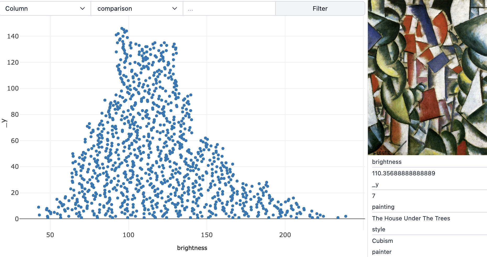
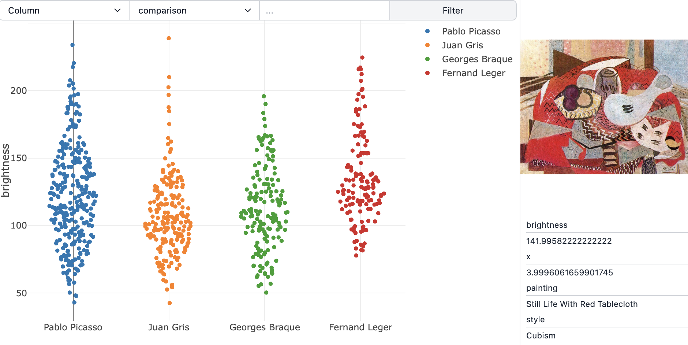
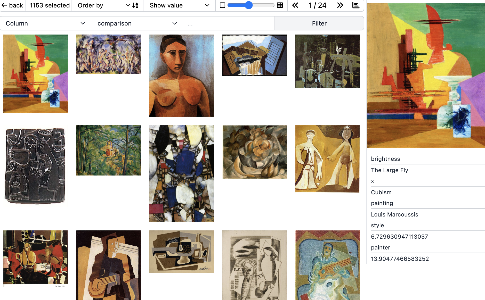
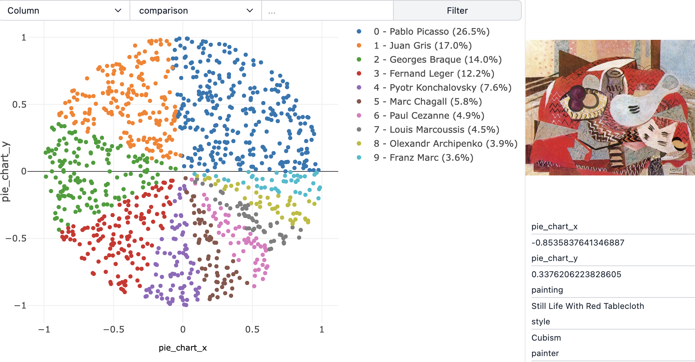

# Clusterfun

[Clusterfun](https://clusterfun.app) is a python plotting library to explore image data.

* [Getting started](#getting-started)
* [A simple example](#a-simple-example)
* [Main features](#main-features)
* [Default parameters](#default-parameters)
* [Plot types](#plot-types)
  + [Histogram](#histogram)
  + [Scatterplot](#scatterplot)
  + [Violin plot](#violin-plot)
  + [Grid](#grid)
  + [Pie chart](#pie-chart)
* [Data loading](#data-loading)

## Getting started
Clusterfun can be installed with pip:

`pip install clusterfun`

Clusterfun requires Python 3.8 or higher.

Plots accept data in the form of a pandas DataFrame, which will be installed automatically if not already present.
No account, payment, or internet connection is required to use clusterfun. Clusterfun is open source and free to use.

## A simple example

```python
import pandas as pd 
import clusterfun as clt

df = pd.read_csv("https://raw.githubusercontent.com/gietema/clusterfun-data/main/wiki-art.csv")
clt.scatter(df, x="x", y="y", media="img_path", color="painter")
```

Data can be hosted locally or on AWS S3.

As you can see, a clusterfun plot takes as input a pandas dataframe and column names indicating which columns to use for the visualisation. In this way, it is similar to the seaborn or the plotly library. But in clusterfun, you can:
- Click and drag to select data to visualise it in a grid
- Hover over data points to see them on the right side of the page
- Click on data points to view zoomed in versions of the image related to the data point

This makes clusterfun ideal for quickly visualising image data, which can be useful in the context of building datasets, exploring edge cases and debugging model performance.


## Main features


## Default parameters
The default parameters for the plot types are as follows:

- `df: pd.DataFrame` (required)

  The dataframe used for the data to plot. Most other parameters are column names in this dataframe (e.g. media, color, etc.).
- `media: str` (required)

   The column name of the media to display in the plot. See data loading for more information about the type of media that can be displayed.
- `show: bool = True`

  Whether to show the plot or not. If show is set to True, clusterfun will start a local server to display the plot in a web browser. More specifically, we start a FastAPI server where we mount the webpage as a static file. The application itself does not require an internet connection. All data is loaded locally and does not leave your machine/browser.
  If show is set to False, clusterfun only saves the required data to serve the plot later on and return the path to where the data is stored. If you want to serve the plot yourself later on, you can run `clusterfun  {path - to - data}|{uuid}` in the command line to start a local server for the plot you are interested in.
- `color: Optional[str] = None`

  If given, points will be colored based on the values in the given column. Powerful for visualising clusters or classes of data.
- `title: Optional[str] = None`

  The title to use for the plot.
- `bounding_box: Optional[str] = None`

   You can visualise bounding boxes on top of your images by with the `bounding_box` parameter. For this to work, you need to have a bounding box column in the dataframe used to plot the data. Each cell in the dataframe needs to contain a dictionary or a list of dictionaries with bounding box values: xmin, ymin, xmax, ymax, label (optional), color (optional). The keys of the expected dictionary are:
  - `xmin: float | int`
  - `ymin: float | int`
  - `xmax: float | int`
  - `ymax: float | int`
  - `label: Optional[str] = None`
  - `color: Optional[str] = None`

  If no color is provided, a default color scheme will be used. The color value can be a color name or hex value. The label will be displayed in the top left of the bounding box.
    Example:
    ```python
    single_bounding_box = { 
      "xmin": 12, 
      "ymin": 10, 
      "xmax": 100, 
      "ymax": 110, 
      "color": "green", 
      "label": "ground truth" 
    }
    ```

## Plot types
The following plot types are available:
- Histogram
- Scatterplot
- Pie chart
- Violin plot
- Grid

### Histogram
```python
def histogram( 
    df: pd.DataFrame, 
    x: str, 
    media: str, 
    bins: int = 20, 
    ...
) -> Path:
```
#### Parameters
- `df: pd.DataFrame`

  The dataframe with the data to plot
- `x: str`

  The column name of the data for the histogram
- `media: str`

  The column name of the media to display
- `bins: int = 20`

  The number of bins to use for the histogram

#### Example
```python
import pandas as pd
import clusterfun as clt

df = pd.read_csv("https://raw.githubusercontent.com/gietema/clusterfun-data/main/wiki-art.csv")
clt.histogram(df, x="brightness", media="img_path")
```


### Scatterplot
```def scatter(
    df: pd.DataFrame,
    x: str,
    y: str,
    ...
) -> Path:
```
#### Parameters
- `df: pd.DataFrame`

  The dataframe with the data to plot
- `x: str`

  The column name of the data for the x-axis
- `y: str`

  The column name of the data for the y-axis

#### Example
```python
import pandas as pd
import clusterfun as clt

df = pd.read_csv("https://raw.githubusercontent.com/gietema/clusterfun-data/main/wiki-art.csv")
clt.scatter(df, x="x", y="y", media="img_path")
```


### Violin plot
```python
def violin(
    df: pd.DataFrame, 
    y: str, 
    ...
) -> Path:
```
#### Parameters
- `df: pd.DataFrame`

  The dataframe with the data to plot
- `y: str`

  The column name of the data for the y-axis

#### Example
```python
import pandas as pd
import clusterfun as clt

df = pd.read_csv("https://raw.githubusercontent.com/gietema/clusterfun-data/main/wiki-art.csv")
df = df[df.painter.isin(["Pablo Picasso", "Juan Gris", "George Braque", "Fernand Leger"])]
clt.violin(df, y="brightness", media="img_path")
```


### Grid
```python
def grid(
    df: pd.DataFrame,
    media: str,
    ...
) -> Path:
```
#### Parameters
- `df: pd.DataFrame`

  The dataframe with the data to plot
- `media: str`

  The column name of the media to display
#### Example
```python
import pandas as pd
import clusterfun as clt

df = pd.read_csv("https://raw.githubusercontent.com/gietema/clusterfun-data/main/wiki-art.csv")
clt.grid(df, media="img_path")
```


### Pie chart
```python
def pie(
    df: pd.DataFrame,
    color: str,
) -> Path:
```
#### Parameters
- `df: pd.DataFrame`

  The dataframe with the data to plot
- `color`

  Column for the pies of the pie chart

#### Example
```python
import pandas as pd
import clusterfun as clt

df = pd.read_csv("https://raw.githubusercontent.com/gietema/clusterfun-data/main/wiki-art.csv")
clt.pie_chart(df, color="painter", media="img_path")
```


## Data loading
Clusterfun supports AWS S3 and local data storage and loading.
The dataframe column corresponding to the media value in the plot will be used to determine where to load the media from.
```python
import clusterfun as clt 

df = pd.read_csv("https://raw.githubusercontent.com/gietema/clusterfun-data/main/wiki-art.csv") 
clt.grid(df, media="img_column")
```

AWS S3 media should start with `s3://`.
Make sure to set a `AWS_REGION` environment variable to the region where your data is stored.

Support for Google Cloud Storage is coming soon.